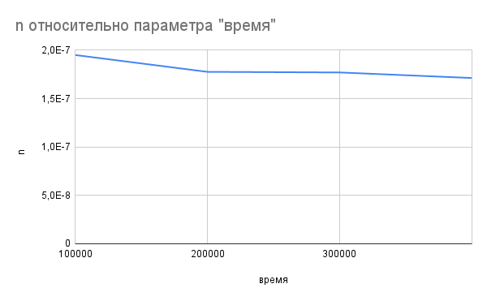
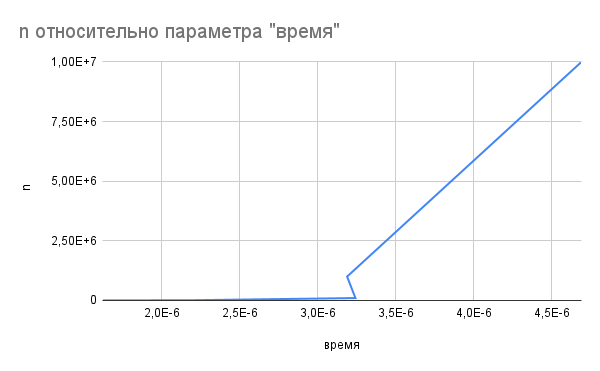
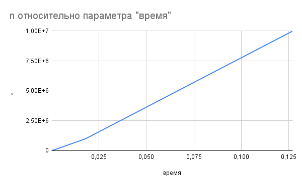
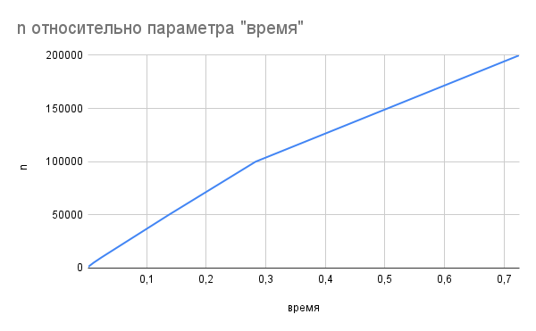
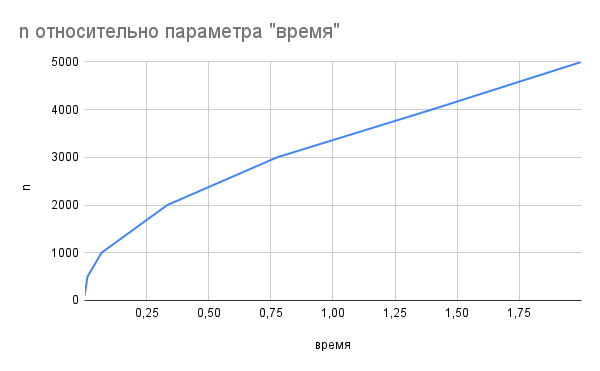
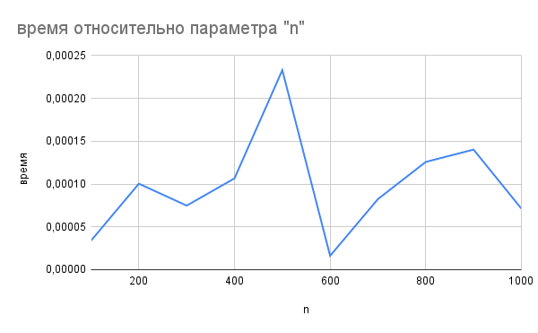
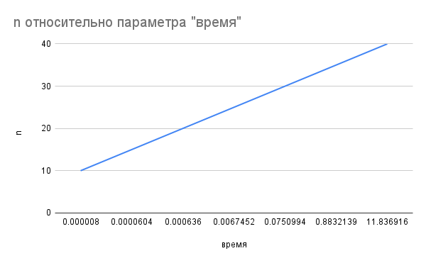
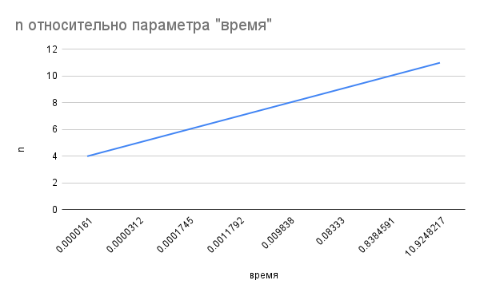

# Группа ИДБ-25-06, 16.03.2026, Лабораторная работа №1, Михайлютин П.Г.

## Вводные данные

- язык программирования: **Python**
- операционная система: **Windows**

## Код

Реализует 8 алгоритмов с различной асимптотической сложностью (от O(1) до O(n!)) и измеряет время их выполнения на наборе входных размеров. Для каждого алгоритма генерируются случайные массивы (или используется число), после чего с помощью функции measure_time, основанной на time.perf_counter, фиксируется среднее время одного вызова (при необходимости с многократным повторением для повышения точности). Результаты выводятся в консоль в виде таблиц, содержащих размер входа и время в секундах.

Ссылка на код:
>https://github.com/jokylooky/Algorithms/blob/main/%D0%9B%D0%B0%D0%B1%D0%B0%201/%D0%9B%D0%B0%D0%B1%D0%B01.py

## Таблица результатов
### f01_access_middle

| n | время (сек) |
|---|------------|
| 100000 | 0.000000195068800 |
| 200000 | 0.000000177663800 |
| 300000 | 0.000000177032400 |
| 400000 | 0.000000171294500 |

### f03_binary_search

| n | время (сек) |
|---|------------|
| 1000 | 0.000001619270000 |
| 10000 | 0.000002201530000 |
| 100000 | 0.000003241210000 |
| 1000000 | 0.000003187640000 |
| 10000000 | 0.000004690590000 |

### f07_find_max

| n | время (сек) |
|---|------------|
| 1000 | 0.000045900000259 |
| 10000 | 0.000205499998629 |
| 100000 | 0.002049299999271 |
| 1000000 | 0.018053999998301 |
| 10000000 | 0.127088700000968 |

### f14_merge_sort

| n | время (сек) |
|---|------------|
| 1000 | 0.001755900000717 |
| 5000 | 0.011047300000428 |
| 10000 | 0.024361700001464 |
| 50000 | 0.137271100000362 |
| 100000 | 0.283150799999930 |
| 200000 | 0.725945100000899 |

### f18_bubble_sort

| n | время (сек) |
|---|------------|
| 100 | 0.000321999999869 |
| 500 | 0.012173999999504 |
| 1000 | 0.068669400001454 |
| 2000 | 0.333385800000542 |
| 3000 | 0.774941300000137 |
| 4000 | 1.397331799998938 |
| 5000 | 1.999851700000363 |

### f26_three_sum_naive

| n | время (сек) |
|---|------------|
| 100 | 0.000033899999835 |
| 200 | 0.000100400000520 |
| 300 | 0.000074800000220 |
| 400 | 0.000106600000436 |
| 500 | 0.000233000000662 |
| 600 | 0.000016199999664 |
| 700 | 0.000082399999883 |
| 800 | 0.000125799999296 |
| 900 | 0.000140199999805 |
| 1000 | 0.000071300000855 |

### f29_fib_naive

| n | время (сек) |
|---|------------|
| 10 | 0.000008000000889 |
| 15 | 0.000060399999711 |
| 20 | 0.000635999998849 |
| 25 | 0.006745200000296 |
| 30 | 0.075099400000909 |
| 35 | 0.883213899998736 |
| 40 | 11.836916000000201 |

### f30_count_perms

| n | время (сек) |
|---|------------|
| 4 | 0.000016100000721 |
| 5 | 0.000031199999285 |
| 6 | 0.000174500000867 |
| 7 | 0.001179200000479 |
| 8 | 0.009837999999945 |
| 9 | 0.083329900000535 |
| 10 | 0.838459099999454 |
| 11 | 10.924821700000393 |

## Графики с зависимостью времени выполнения от количества элементов

### f01_access_middle

### f03_binary_search

### f07_find_max

### f14_merge_sort

### f18_bubble_sort

### f26_three_sum_naive

### f29_fib_naive

### f30_count_perms

